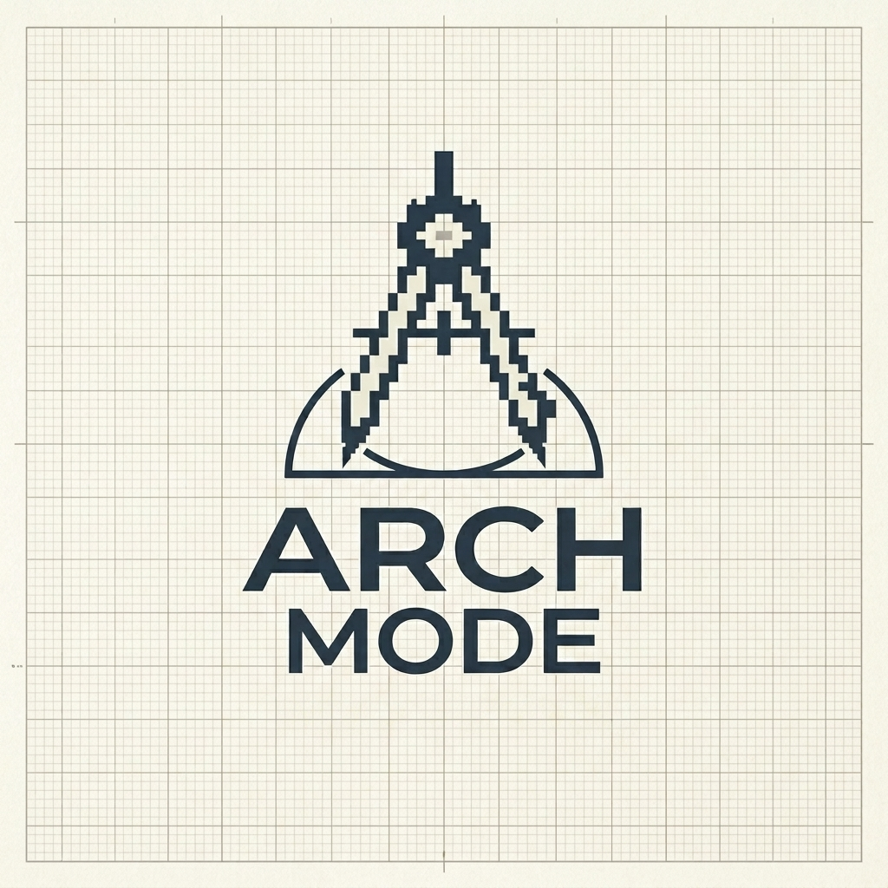

# pi-arch-mode

<p align="center">
  
</p>

A Pi extension that puts the coding agent into **architecture mode** — a mode for deep exploration, collaborative thinking, and decision-making. The agent reads your codebase, explains it using architectural patterns and UML concepts, and helps you surface trade-offs and make deliberate design decisions.

## Installation

```bash
pi install npm:@kkkiio/pi-arch-mode
```

Or install from git:

```bash
pi install git:github.com/kkkiio/pi-arch-mode
```

Or install locally for development:

```bash
# cd /path/to/pi-arch-mode
pi install .
```

## Usage

Enter architecture mode:

```
/arch
```

Or enter with a topic:

```
/arch I need to figure out how to handle multi-tenant data isolation
```

Exit architecture mode:

```
/arch-off
```

In architecture mode, the agent:

- Explores your codebase to understand the current state
- Explains architecture using common patterns and UML-level concepts
- Surfaces hidden assumptions and trade-offs
- Can write documentation files (`.md`, `.mdx`, `.txt`, `.html`, `.yaml`, `.yml`, `.json`) and HTML diagrams with Mermaid.js
- Cannot modify implementation code (`.ts`, `.js`, `.rs`, `.py`, `.go`, etc.)

The status bar shows `🏗️ arch mode` while active.

### Example session

```
You: /arch I need to figure out how to handle multi-tenant data isolation

Agent: [reads db/schema.ts, middleware/tenant.ts, config/]
       I've reviewed the current schema and tenant middleware. The system
       uses a shared-database approach with a tenant_id column. The main
       trade-off is row-level security vs. application-level filtering.
       [writes adrs/005-multi-tenant-isolation.md]

       Key decisions recorded. Run /arch-off when you're ready to move forward.

You: /arch-off
```

## Features

- **Exploration-first**: Agent reads and understands before suggesting, not the other way around
- **Decision recording**: Agent can write ADRs, PRDs, and design notes when alignment is reached
- **Safe by default**: Implementation code is write-protected; bash is restricted to safe commands. Switching modes has no performance impact — the system prompt and tool set are never modified.
- **State persistence**: Architecture mode state survives session restarts and `/fork`

## Relationship to automated development loops

Architecture mode is designed to be the **upstream input** for automated agent workflows ("Loop"): align on goals, constraints, and key decisions here, then let automated loops decompose tasks, write code, review, and iterate based on those decisions.

## Development

See [AGENTS.md](./AGENTS.md) for contributor documentation.
